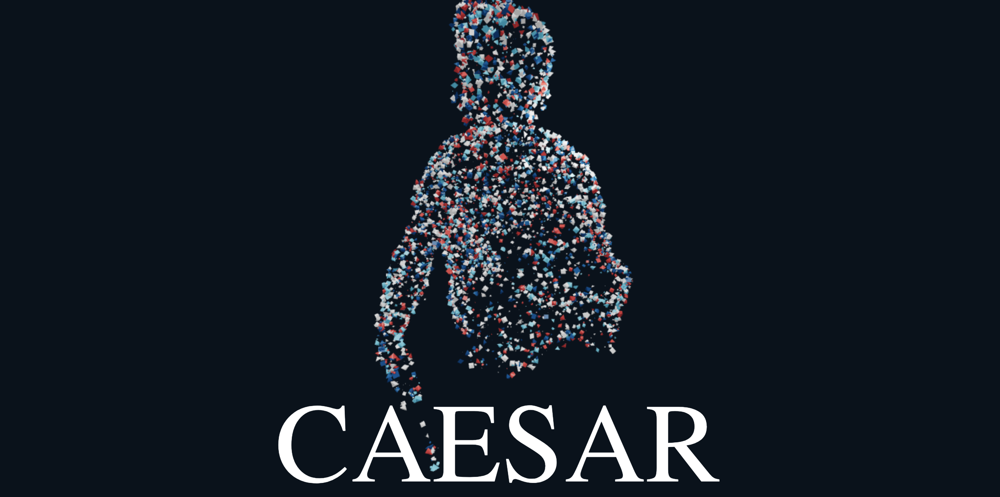

# Surface sampling

A demo of THREE's Mesh Surface Sampler built using React Three Fiber.

See it in action here: [https://happy-swirles-1eb4b4.netlify.app/](https://happy-swirles-1eb4b4.netlify.app/)

Original 3D model taken from [here](https://sketchfab.com/3d-models/cesar-louvre-museum-30f43907f7814582b5dacbbadbabbe6d).

